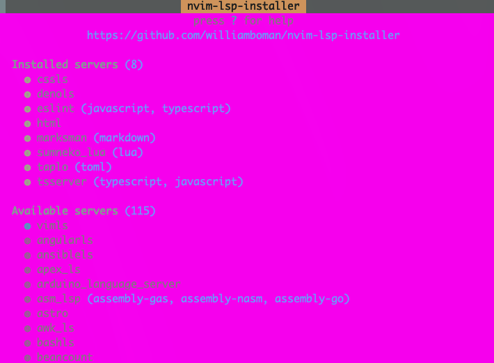
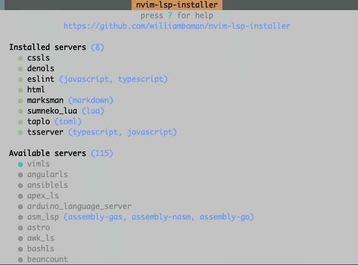

# How we created this plugin
I am a novice plugin developer.
I thought I would make a plugin for a simple function written in vimrc.
There are already useful plugins in this world with similar functions.
However, the reason I created this plugin is to study my plugin development.

# Feature
- Change the color of Pmenu to a calmer color.
- Color designation is not available.

# Example
## before

## after

# Install
Fill in the Plug-in Manager.
- For dein.vim

'''
[[plugins]]
repo = 'Daiki48/hi-popmenu.vim'
'''
